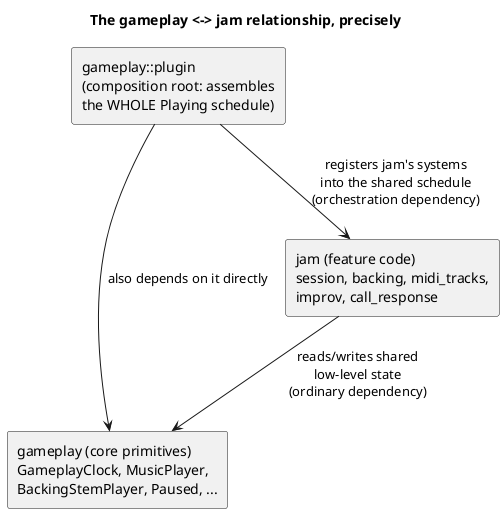
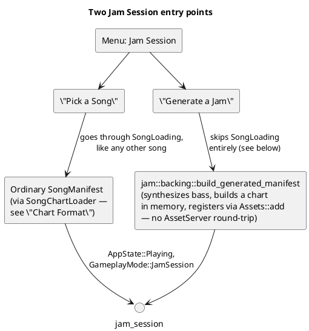
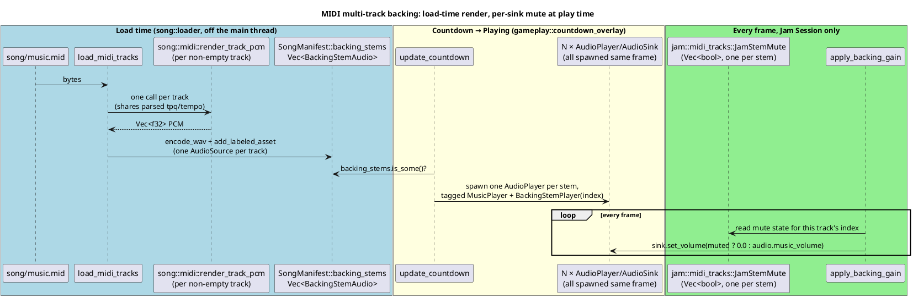
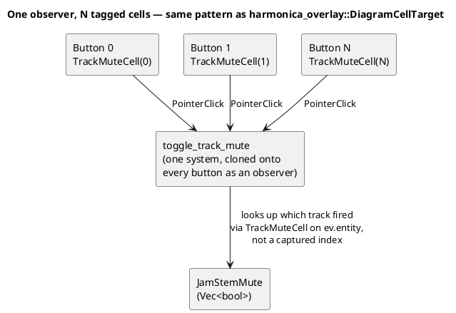

# Jam Session

Jam Session (`harmonicon-jam`) is Harmonicon's free-play mode: a rolling
12-bar backing, a live hole-map guide, and — deliberately — nothing
scored. This chapter covers how it shares `gameplay`'s core
infrastructure without being a `gameplay` submodule itself, the two ways
it can produce backing audio (a procedurally generated rhythm section, or a
picked song), and, in the most depth, the MIDI multi-track backing and
per-track mute feature — the newest and architecturally most interesting
piece of this subsystem, since it's the one place in the codebase that
plays more than one background-music sink at once.

## Why `jam` is a sibling of `gameplay`, not part of it

`GameplayMode::JamSession` is one of three values a `Res<GameplayMode>`
can hold while `AppState::Playing` is active (see
[Application States and Modes](app-states.md)) — so in one sense, Jam
Session *is* a gameplay mode. But its own code lives in a separate
top-level module, `jam/`, not inside `gameplay/`. This is a deliberate
split, and it reads as a genuine two-way dependency at first glance —
worth being honest about rather than glossing over, since it's the kind
of thing [Module Boundaries and Dependency Rules](
module-dependency-rules.md) exists to explain clearly:

`gameplay::plugin` (the *composition root* — the one place that
assembles the entire `AppState::Playing` schedule for all three
`GameplayMode`s) imports from `jam` to register Jam-Session-specific
systems (`jam::hole_map::update_hole_map`, `jam::midi_tracks::
apply_backing_gain`, and so on) into that shared schedule, alongside
`gameplay`'s own 2D/3D-specific systems. `jam`'s actual feature code, in
turn, depends on `gameplay`'s core primitives — `GameplayClock`,
`MusicPlayer`, `BackingStemPlayer` — as shared low-level vocabulary, the
same way `song_editor` or any other feature would. What makes this
*not* a real circular dependency in the problematic sense: a composition
root is expected to depend on everything it wires together (that's its
whole job), while `jam`'s own feature logic never reaches back into
`gameplay`'s feature logic (2D/3D rendering, scoring) — only into the
primitives `gameplay::state` exists specifically to share. `jam` is a
sibling feature that happens to plug into `gameplay`'s shared schedule,
not a sub-feature of it.

## Two ways to get a backing track

**"Pick a Song"** routes through the ordinary song-loading pipeline
described in [Chart Format and Asset Loading](chart-and-assets.md) —
any bundled or `~/Harmonicon` song can be jammed over.

**"Generate a Jam"** is the no-existing-song alternative:
`jam::backing::build_generated_manifest` synthesizes sample-aligned Bass,
Drums, and Comping stems at runtime. The bass retains its speaker-aware
harmonic tone, while deterministic percussion and chordal patterns establish
the selected genre without occupying the harmonica voice. Each stem is encoded
to WAV and registered as a real `AudioSource` asset directly via `Assets::add`
— never going through the
`AssetServer`'s load path or `AppState::SongLoading` at all, because
there's no file on disk to load in the first place. A
`GeneratedJamSession` marker resource is what lets the surrounding menu
routing (see [Application States and Modes](app-states.md)) recognize
this case and skip the loading screen, and lets "Quit Song" route back
to the generation page instead of a song list a generated jam never
went through.

Generated backing is rendered in four-chorus buffers, but the session is
continuous: when one buffer exhausts, Jam Session respawns it without rewinding
the free-running gameplay clock, so the form display proceeds into chorus 9.
This is separate from `JamLoop`, which remains an opt-in preference for a
finite picked song. `JamEnding` schedules **End after this chorus** at the next
12-bar boundary; the backing sinks stop there, a short tonic punctuation plays,
and the clock holds at the boundary until Restart or Quit.

## MIDI multi-track backing: independent, synchronized sinks

This is the newest piece of `jam`, and the one with the most interesting
architecture, because it's the first (and so far only) place in
Harmonicon that plays **more than one background-music sink
simultaneously**.

### The constraint that shaped the design

Every other audio-producing path in the codebase — the generated rhythm
section above, the Song Editor's MIDI-import backing mixdown, every
preview/practice/record playback, `gameplay::call_response`'s one-shot
call demo — follows the same shape: build a note list, render it *once*
to a flat PCM buffer via the shared additive synth, and hand the result
to a *single* `AudioSink`. There is no live/streaming audio-mixing
capability anywhere in the engine. Naively, "let the player mute
individual MIDI tracks live" sounds like it needs one — re-mixing the
active subset of tracks into a fresh buffer every time the player clicks
a mute button, mid-playback.

It doesn't, and this is the key design insight: **mute doesn't require
re-mixing if every track is already an independent, complete render,
played as its own simultaneous sink.** Muting one track is then just
setting *that sink's* volume to zero — an operation `bevy_audio`
supports natively per-sink, with no re-rendering, no re-encoding, and no
new streaming infrastructure at all.

### Why each sink is tagged `MusicPlayer` *and* `BackingStemPlayer`

`MusicPlayer` is the ordinary, pre-existing marker component that tags
"the currently-playing background-music entity" for pause/resume and
global-volume-slider application (`gameplay::lifecycle::
apply_music_volume`, `gameplay::pause_menu`) — code written for the
single-sink case, years before multi-track backing existed. Tagging
every per-track sink with `MusicPlayer` *too* (alongside the new,
per-stem `BackingStemPlayer(usize)`) means that existing pause and
global-volume code needs **zero changes** to correctly apply to N sinks
instead of one — it already iterates every matching entity, never
assumed there'd be exactly one. The two places in the codebase that
*do* assume a single sink (`Query::single()`, in `gameplay::clock`'s
wait-for-note pause/play check and A–B loop boundary handling) simply
see "zero or multiple" as the same "nothing to anchor to" case they
already handle gracefully for a music-less song — and neither code path
is reachable in Jam Session anyway (no `SongNotes`, no A–B loop UI
there), so this was verified safe rather than assumed safe.

`BackingStemPlayer(usize)` itself lives in `gameplay::state`, not in
`jam::midi_tracks` where it's *read* — the same "define shared
low-level vocabulary where the lower layer needs it, not where the
higher one reads it" placement `MusicPlayer` itself already follows
(`countdown_overlay`, which *spawns* the component, can't depend on
`jam` without inverting the dependency direction the section above
described).

### Why mute always wins over a global volume change

`apply_backing_gain` is ordered `.after(gameplay::lifecycle::
apply_music_volume)` (see [The Plugin Architecture](
plugin-architecture.md) for what this ordering primitive means). Both
systems can write the same sink's volume in the same frame — dragging
the Options volume slider fires `apply_music_volume`, which sets *every*
`MusicPlayer` sink (per-track ones included) to the new global level,
which would silently un-mute a muted track if nothing ran afterward to
re-assert it. The explicit ordering constraint is what guarantees mute
always has the last word, deterministically, rather than depending on
whichever order Bevy's scheduler happened to pick that frame.

### The UI: one shared observer, not N closures

The per-stem mute row (`jam::midi_tracks::spawn_backing_stem_row`) spawns
one button per track, each tagged `TrackMuteCell(index)`, all sharing
**one** `toggle_track_mute` observer function (cloned onto every
button's entity) rather than a distinct closure capturing a different
index per button:

This is the same mechanical pattern `gameplay::harmonica_overlay::
DiagramCellTarget` already established for the Bending Trainer's
selectable diagram cells — a reusable idiom in this codebase for "N
dynamically spawned, independently clickable things sharing one piece of
click-handling logic," worth recognizing as a pattern rather than
reinventing per feature.

### Looping preserves mute state for free

`restart_finished_jam_music` (which re-spawns every track's sink
together once the previous set has fully finished, when Loop is on)
doesn't touch `JamStemMute` at all — it's a resource independent of any
particular sink's lifetime, so a track muted before the loop boundary
stays muted after new sinks spawn, with no explicit hand-off code
needed.

## Improv and call-and-response

Two smaller `jam` submodules round out free-play practice, both built
on `ImprovStats`/`ActivePitches` (the same live-pitch data scoring
consumes — see [The Scoring System](scoring-system.md)) without scoring
anything themselves:

- **`jam::improv`** — accumulates scale/chord-tone/phrase-discipline
  adherence continuously during any jam (an "always-on diagnostic," the
  same convention `SongStats::clean_attack` follows in real gameplay),
  which several Lessons pass criteria read from without Jam Session
  needing to know Lessons exists at all — see
  [The Lessons Engine](lessons-engine.md).
- **`jam::call_response`** — freeform, *unscored* call-and-response: the
  game plays a short generated phrase over the two bars it covers and
  gives the player a couple of bars to answer it by ear, with purely
  visual turn-taking feedback (a banner, the call's holes
  ghost-highlighted on the hole map) — deliberately no
  `PitchGate`/`ImprovStats` involvement, since there's no authored
  target to judge against, just a suggestion. The phrase itself is
  `call_response::phrase::generate_call`, a pure function of the two
  bars' chords, the jam scale, the harp the player is holding
  (`phrase::playable_notes` — plain blows and draws only), the backing's
  straight/shuffle feel, a density (`CallDensity`: sparse,
  conversational, busy — the one control the player gets) and a seed:
  a rhythm cell per bar (rests, pickups, held and repeated notes), a
  two-to-four-note motif in a fifth's range, and an answering bar that
  repeats or sequences it, every consecutive pair a playable hole/breath
  move, every non-chord note resolving to a chord tone next, the last
  note a chord tone, and the ending bar over by beat 3 so there is air
  before "Your turn". While the call sounds, `CallDuck` eases the
  backing down to 60 % and back, applied by
  `midi_tracks::apply_backing_gain` in the same pass as stem mute.
- **`jam::band`** — the generated band listening without grading:
  `BandListener` takes one `BeatActivity` per beat (fresh attacks and
  presence, never pitch) and decides, only at phrase boundaries, whether
  the comping thins for the coming four bars (after a dense phrase; a
  silence keeps the pocket) and, at beat 3 of a phrase's last bar,
  whether to answer a phrase the player has just released with a
  two-beat drum fill or chord push (`backing::render_band_answer`),
  rate-capped to one per eight bars. `BandTracker` eases the comping
  gain over a bar and `apply_backing_gain` applies it to the comping
  stem; `AdaptiveBand` switches the reactions off. Generated jams only.
