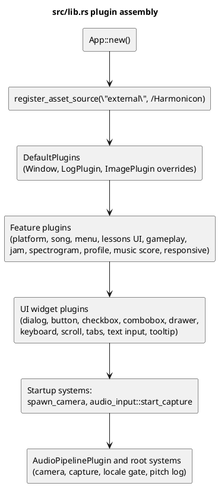

# The Plugin Architecture

Harmonicon is built almost entirely out of Bevy `Plugin`s — the standard
Bevy pattern for packaging a chunk of app configuration (resources,
messages/events, systems, sub-plugins) behind a single type that
`App::add_plugins` consumes. This chapter describes the conventions
Harmonicon layers on top of that pattern: how plugins are composed, how
resources/components/messages are used to communicate between systems,
and how system ordering is expressed and enforced.

## Composition in `src/lib.rs`

`src/main.rs` and Android's `android_main` both call `harmonicon::run()`.
The root plugin assembly lives in `src/lib.rs`:

Two ordering details here are load-bearing, not incidental:

- **The external asset source is registered before `DefaultPlugins`.**
  Bevy's `AssetPlugin` (part of `DefaultPlugins`) builds every registered
  `AssetSource` when *it* is added, not on first use — registering
  `"external"` afterward would mean `external://...` paths silently
  never resolve, with no assets at all under `~/Harmonicon` ever loading
  and no error pointing at why.
- **Microphone capture starts after settings load.**
  `audio_input::start_capture.after(settings::apply_loaded_settings)` — a
  saved `AudioSettings::input_device` preference has to already be in the
  `AudioSettings` resource before capture picks a device, or the game
  would always start on the system default regardless of what the player
  configured last session.

The composition root registers `PitchEvent`, `AudioFrame`, and `PitchRange`
and starts camera and microphone capture. `AudioPipelinePlugin` owns audio
processing; the root gates entry to the menu on localization readiness.
See [Module Boundaries and Dependency Rules](module-dependency-rules.md)
for the crate boundaries and build-time checks.

## Sub-plugins for large features

A feature large enough to have its own internal sub-features composes
its own `Plugin`s the same way `src/lib.rs` composes top-level ones.
`GameplayPlugin` (in `gameplay/plugin.rs`) is the largest example: it
registers overlay plugins, gameplay resources, messages, and scheduled
systems. `JamPlugin` owns Jam Session systems in its separate crate.

## Resources vs. components vs. messages

Harmonicon follows Bevy's own idiomatic split, applied consistently
enough across the codebase that it's worth naming explicitly:

- **A `Resource`** holds state that exists at most once, globally or per
  active mode — `GameplayClock`, `Score`, `AudioSettings`,
  `SelectedSong`, `EditorState` (the Song Editor's entire in-memory
  document). Most of Harmonicon's actual "model" data lives in
  resources, not components — see the callout on this in
  [The Scoring System](scoring-system.md), which explains why scored
  notes live in a `SongNotes` resource (a `Vec` + cursor) rather than as
  one ECS component per note.
- **A `Component`** tags an *entity* — usually either a visual (a
  spawned note sprite, a UI button) or a marker used to find a
  particular kind of entity via a `Query` filter (`MusicPlayer` tags the
  currently-playing background-music entity so pause/volume systems can
  find it without threading a resource-held `Entity` handle through
  every call site that needs it).
- **A `Message`** is used for discrete,
  one-shot occurrences a system wants to react to on the frame they
  happen, rather than poll for continuously — `PitchEvent` (one per
  analyzed audio chunk), `NoteScored` (fired the instant `score_notes`
  judges a note, consumed by the HUD to animate a hit-feedback burst
  rather than the HUD polling `Score` every frame and trying to detect
  "did this go up just now"), `SongsRescanned`/`ThemesRescanned`/
  `LessonsRescanned` (fired only when a *live* filesystem-watcher rescan
  actually found something new — see [Persistence](persistence.md) —
  distinct from the resource simply existing, which a page's own
  `resource_changed` change-detection would otherwise also catch on
  every re-entry into that page).

Every `#[derive(Message)]` type in the codebase must be registered with
`.add_message::<T>()` somewhere, or Bevy panics at runtime the first
time some system's `MessageReader`/`MessageWriter` for it actually
runs — a failure mode that's easy to introduce (the type still compiles
fine unregistered) and easy to not notice until that code path
happens to fire, sometimes well after the type was added. `build.rs`
statically scans for this at every build and fails the build if it finds
an unregistered one — see [Testing Strategy](testing-strategy.md) for
the other build-time checks living alongside it.

## Expressing system ordering: `SystemSet`s and `.after()`

Bevy runs a frame's systems according to a schedule the developer only
partially constrains — anything not explicitly ordered may run in any
relative order (parallelized where the borrow checker allows it), which
is fine for most systems but actively wrong for a few. Harmonicon uses
two mechanisms to constrain the parts that need it:

- **`SystemSet`s** name a *group* of systems so other systems can order
  themselves relative to the whole group at once, without listing every
  member. The most important one in the codebase is `GameplayLogic`
  (`gameplay/plugin.rs`): the chain of systems that ticks the gameplay
  clock, judges scoring, and advances the current bar. Every system that
  *reads* the clock — note movement, HUD displays, overlay tints — is
  ordered `.after(GameplayLogic)`, or it risks reading a stale clock
  value on some frames and visibly stuttering. See
  [The Gameplay Clock](gameplay-clock.md) for why this matters as much
  as it does.
- **`.after(some_system)`** orders one system directly after a specific
  other one, used where the relationship is narrower than "after this
  whole named phase" — for instance, `jam::midi_tracks::
  apply_backing_gain` (see [Jam Session](jam-session-architecture.md))
  is ordered `.after(MusicVolumeSet)` so a
  mid-song global-volume change can never accidentally un-mute a track
  the player muted a moment earlier: both systems touch the same sinks'
  volume, and whichever ran second wins, so the ordering is what
  guarantees mute always has the final say.

`.chain()` is used where an entire tuple of systems needs to run in the
literal order written, most commonly for a short setup sequence where a
later system genuinely depends on an earlier one's resource writes
having already landed (e.g. `gameplay_2d::setup`/`gameplay_3d::setup`
reading `AdaptiveDifficulty` while `setup_adaptive_difficulty` writes it,
in the same `OnEnter(AppState::Playing)` tuple).

## `run_if`: conditional execution instead of conditional logic

Rather than a system checking "is this the right mode/state?" as its
first lines and returning early, Harmonicon prefers `run_if` predicates
attached at registration time — `in_state(AppState::Playing)`,
`resource_changed::<AudioSettings>`, or a custom closure like
`|m: Res<GameplayMode>| *m == GameplayMode::JamSession`. This keeps a
system's own body free of state-checking noise, makes the *conditions*
under which something runs visible at a glance in the plugin's
registration block (several such conditions are frequently `.and_then`-
chained together, e.g. "only in `Playing`, only when not paused, only in
Jam Session mode" for the Jam-Session-specific systems), and — not
purely cosmetic — means Bevy's own scheduler can skip a system's query
initialization entirely on a frame its condition is false, rather than
the system paying that cost and then no-op'ing internally.
