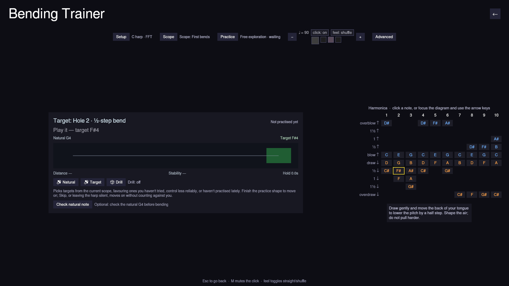

# Bending Trainer

**Play → Bending Trainer** is a practice screen for controlling one bend at a
time: no song, just the hole you're working on, a live picture of your pitch,
and the harmonica's full bend diagram. It's a tool for finding, holding and
releasing a bend, not a lesson, so it never grades you pass or fail.

The screen has three parts:

- **A strip across the top** for the things you set once and leave: **Setup**
  (your harp's key and the pitch detector, summarised as e.g. *C harp · FFT*),
  **Scope** and **Practice** (below), the metronome with its tempo buttons,
  and **Advanced**.
- **The target card**, the large panel at the centre. It shows what you're
  practising and how close you are, with every button the current attempt
  needs.
- **The harmonica diagram**, beside the card on a wide screen and below it
  when a tablet is held upright. The layout follows the tablet as you turn it.

**Setup** and **Advanced** open as panels that float over the screen, so
opening one never moves the pitch display you're watching. Press the same
button again to close it.

## Picking a target

Click any cell in the diagram to make it the target. You can also press
**Tab** to focus the diagram, move around it with the **arrow keys**, and
press **Enter** or **Space** to choose a cell. The target card names the hole
and technique, and says how it has gone for you so far (*Not practised yet*,
or e.g. *7 of 10 controlled*).

**Natural** plays the hole's unbent note and **Target** plays the note you're
aiming for, as clean reference tones, so you can hear the interval before you
try to bend it. **Check natural note** is an optional first step: it asks for
the unbent note on that hole, which confirms the microphone is following the
right hole. It also measures where that reed actually sits on your harp,
since real reeds rarely match the textbook tuning exactly. From then on, that
hole is judged against your harp rather than the table.

## Reading the pitch rail

The tuner line reports how far you are from the target and in which
direction. It only does so for notes that belong to the selected hole:
silence, the wrong hole and an unsteady signal each get their own message
instead of a misleading number.

Below it, the **rail** runs from the natural note on the left to the target
band on the right. The bright marker is your pitch right now, and the fading
dots behind it are the last few seconds of movement. From them you can see a
smooth approach, a scoop, an overshoot past the target, or a pitch that
settled. When a hole has several bend depths, the shallower ones are marked
along the way to a deeper target. Three separate readouts sit under the rail:
distance from the target, how steady the pitch is, and how long you've held
it centred.

## Practice and the drill

**Practice** chooses what counts as one success. *Free exploration* adds
nothing. The other shapes ask you to find and hold the target, bend and come
back to the natural note, repeat the bend on metronome beats, climb through
the bend depths and back, or attack and release an overbend. The status next
to the button shows which stage you're at.

**Scope** chooses which targets the drill uses: *First bends* (holes 2 and 3
draw bends, the default), *All bends*, *Blow bends*, *Overbends*, or *Custom*.
With Custom selected, clicking diagram cells adds them to the drill or takes
them out again.

Turn on **Drill** and Harmonicon picks targets for you from that scope. It
favours ones you haven't tried, ones you control less reliably or less
steadily, and ones you haven't practised for a while. It moves on when you
complete the chosen practice shape. **Skip** moves on straight away. Neither
Skip nor putting the harp down counts against you: an attempt only counts
once the microphone has heard you play that hole. Your record is saved
between sessions.

The diagram doubles as a progress map. Each cell is tinted by how often you
control it, and a bar along its bottom edge grows with the same number, so
you can read your progress without telling red from green. Cells you've never
tried have no bar.

## Advanced

**Advanced** is for precision work, and you can ignore it entirely. It sets
the tolerance, how long a hold must last, how long an attempt may take, the A4
reference pitch, how much pitch history the rail shows and how much it's
smoothed, and how many pulses per beat the *Repeated* shape asks for. Its
**This attempt** section shows your mean distance from the target, how widely
the pitch wandered, your best hold, and your vibrato's speed and width. It
also shows the measured reed centre from **Check natural note**, with
**Forget measured reed** to discard it. **Reset** puts every setting back.
These readings describe the pitch and nothing else: the trainer makes no
claims about breath, embouchure or the health of your reeds, because a
microphone can't tell.

## Leaving

There's no pause menu here, because there's no song to pause. Click **Back**
in the header, or press **Esc**, to return to the Play menu. Your drill
progress is saved on the way out.
