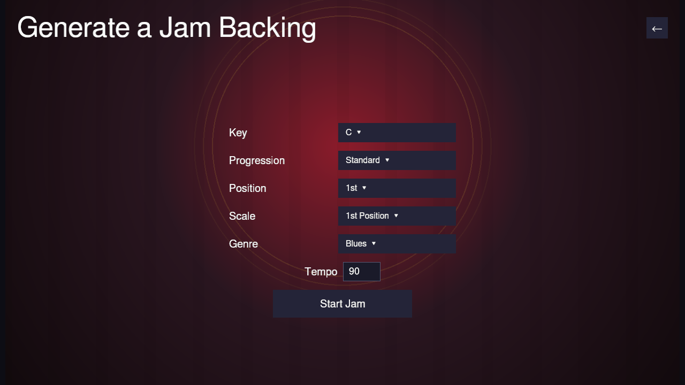

# Generate a Jam

**Play → Jam Session → Generate Jam** skips picking a song entirely: it
synthesizes an endless 12-bar rhythm section on the spot, with separate bass,
drum, and chordal-comping stems, so you can jam without needing any existing
content.

The band marks the ends of each four-bar phrase with short drum pickups and
uses the final bar for a bass-and-drum turnaround into the next chorus. These
variations leave the next downbeat and the harmonica register clear.
Across four choruses, the arrangement grows from a sparse opening to a fuller
third chorus, then relaxes before beginning the arc again.
Small timing and touch differences keep the players from landing like one
machine, while the downbeats and bar lengths remain locked together. Restart
replays the same performance; starting a new jam creates a fresh variation.
Use **Band energy** to make that arc quieter and roomier or denser and more
assertive. It changes accompaniment density and dynamics without changing the
tempo or chord progression.

Before starting, pick:

- **Key** — a dropdown of all twelve chromatic keys.
- **Progression** — **Standard** (I-I-I-I-IV-IV-I-I-V-IV-I-V, the classic
  12-bar form), **Quick Change** (moves to the IV a bar early), **Minor
  Blues** (the i/iv chords become minor), or **Jazz Blues** (a ii-V-I
  cadence in the last few bars).
- **Band energy** — **Low**, **Medium**, or **High** accompaniment density
  and dynamics. It does not alter tempo or harmony.
- **Position** — which cross-harp position to play in: **1st** (straight
  harp, same key as the jam), **2nd** (cross harp, the classic blues
  choice — a harp a fourth below the jam key), or **3rd** (a harp a whole
  step below).
- **Scale** — the note palette used by the live hole guide.
- **Genre** — **Blues**, **Jazz**, **Rock**, **Reggae**, or **Country**. Each
  changes the bass pattern, drum pocket, comping rhythm, and instrument tone.
- **Tempo** — type a BPM value directly (60–160; out-of-range or
  non-numeric input is clamped/corrected once you press Enter or click
  away).

Click **Start Jam** and you're straight into an ordinary
[Jam Session](jam-session.md) — the same calm form display and optional Guides,
just with a generated backing instead of a real song's. It keeps playing
across backing-buffer boundaries automatically;
the chorus/bar readout remains continuous. Choose **End after this chorus**
to stop at the next 12-bar boundary with a two-beat tonic hit from the whole
rhythm section. Muted stems stay muted for that ending. **Restart** returns to
the count-in and chorus 1; **Quit Song** returns to this setup page (with your
setup choices remembered), not the song list, since there was never a song
list involved. The stem buttons let you mute Bass, Drums, or Comping
independently without disturbing the timing of the others.
