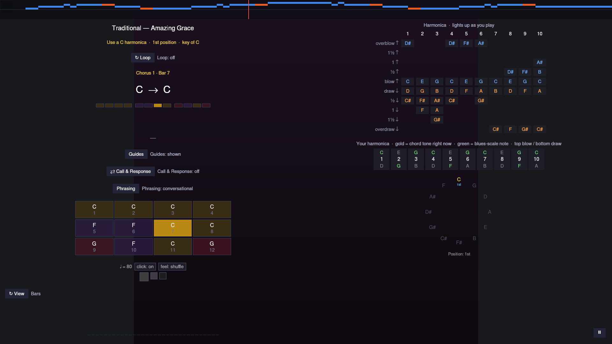

# Jam Session

**Play → Jam Session → Pick a Song** is free play: pick an artist and song
the same way as [Playing a Song](playing-a-song.md), but instead of scored
falling notes, you get an open 12-bar backing to improvise over, for as
long as you like — there's no finite end and nothing is scored.

The screen is split into two columns:

- **Left — everything but the harmonica**: the song title, a **Loop**
  toggle (restarts the backing track when it ends, instead of stopping),
  the chorus/bar position, the **12-bar chord grid** (the current bar lights up as the backing
  plays), the **metronome**, and a live **spectrogram** of what your mic is
  hearing.
- **Right — the harmonica**: a reference bend diagram for every hole, plus
  a **live-tinted hole map** — as you play, each hole/direction recolors:
  **gold** for a chord tone of the bar currently sounding, **green** for
  anywhere else in the blues scale, and left dim for out-of-scale notes.
  Follow the color, not memorized theory.

There's no "wrong note" here in the scored sense — the hole map is a guide,
not a judge. It's the same live feedback the
[improvisation lesson](lessons.md#unit-2--counting-the-blues) uses, so
practicing here and in that lesson builds the same skill.

Want a backing track without picking an existing song? See
[Generate a Jam](jam-generate.md). Generated jams continue automatically and
replace the finite-song Loop control with **End after this chorus**.

Press **Esc**, or click the **⏸** button in the bottom-right corner, to
pause and reach the pause menu's Restart/Quit Session controls.

## Call & Response

Turn on **⇄ Call & Response** and the game takes turns with you: every
four bars it plays a short harmonica phrase over the chords that are
sounding — two bars of "Listen…" — then steps back for two bars of
"Your turn". Answer however you like: echo it, vary it, or play
something else entirely. Nothing is compared or scored; the hole map
just shows the call's holes in a soft violet until the next one, as a
reminder of where it went, and lights whatever you play in the usual
colours.

The phrases are made for the harmonica you're holding, using only plain
blow and draw notes, so a call never asks for a bend you can't reach.
Each one has a little shape to it — a short motif, some space, an
answer that repeats or moves it up or down — and always lands on a
chord tone with a breath of air before your turn. The backing dips
slightly while the call speaks so it's easy to hear.

**Phrasing** cycles how busy the calls are: **sparse** (a few long
notes, lots of room), **conversational** (the default) or **busy**
(eighth-note runs). It's a mood, not a difficulty level — pick whichever
you'd rather trade phrases with.

## MIDI backing with per-track muting

If the song you picked was authored from a MIDI file that kept its
original tracks (rather than one pre-mixed backing track), a row of
buttons appears below the 12-bar grid and the harmonica, one per track,
each showing 🔊 next to the track's name. Click one to mute it — it
switches to 🔇 and drops out of the mix instantly, with no effect on the
other tracks or on timing; click it again to bring it back. This is handy
for stripping out a bass or rhythm track you'd rather play yourself, or
just hearing what one part of the arrangement sounds like on its own.
Mute state resets to "everything audible" each time you start the jam,
and — if Loop is on — carries over unchanged when the backing loops back
to the start.
