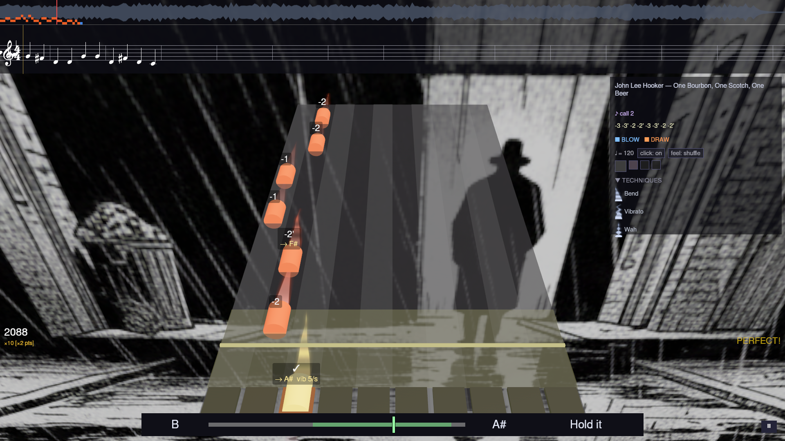

# Play 3D

The 3D mode shows the same chart, notes, and scoring as [Play 2D](
play-2d.md), but as a lane seen in perspective, with notes travelling
toward you.

- One lane per hole, with a row of **hole pads** at the near end: a pad
  glows blue or orange when you play that hole, and dimly when a note in
  its lane is due. The bright line across the lane is the moment to play.
- The camera looks down the lane steeply enough that notes keep a steady
  pace all the way in, rather than crawling in the distance and rushing
  the last stretch.
- Each note carries a label with its tab — including bend marks, `-2'` —
  and, for a technique note, what it asks for (*→ F#*, *vib 4/s*). Plain
  notes get a label only with Options → Note labels on.
- The same **technique coach bar** as Play 2D sits along the bottom on
  songs with bends, vibrato or wah (see
  [Playing a Song](playing-a-song.md)).

Scoring, the HUD, pausing, A–B looping, Wait for Note, Practice Speed, and
Adaptive Difficulty all work exactly as described in
[Playing a Song](playing-a-song.md) — 2D and 3D are purely a visual choice
made once, at Select Mode.
